# 🐦‍🔥 Phoenix

**Phoenix is the platform. Fawkes is the pet.**

Phoenix is an open-source developer companion. It connects your developer tools, meetings and AI agents through a common event and capability architecture, and shows what is happening through **Fawkes**, an animated pet that lives in your navbar or floats on your desktop.



The first capability is **Kage**, which handles meeting capture, transcription, summaries and archiving.

> Status: early development (Stage 1 — MVP Foundation). See the [phase tracker](docs/phases/TRACKER.md).

## Repository layout

| Path            | Contents                                                                     |
| --------------- | ---------------------------------------------------------------------------- |
| `protocol/`     | Versioned event schema, error codes, Fawkes state definitions                |
| `core/`         | Phoenix Core: config, logging, persistence, event bus, state engine, runtime |
| `pet/`          | Fawkes runtime, states, animations and assets                                |
| `apps/`         | `web` (navbar + Pet Panel) and `desktop` (floating Fawkes)                   |
| `sdk/`          | Capability SDK                                                               |
| `capabilities/` | First-party capabilities (Kage, Git, terminal)                               |
| `docs/`         | Vision, phases, ADRs, contracts                                              |

## Getting started

Requires Node.js ≥ 22.13 and pnpm 10.

```sh
pnpm install
pnpm check        # typecheck + lint + tests
pnpm start        # build the web app and start Phoenix Core
```

Open <http://127.0.0.1:4870>. Fawkes lives in the top bar; click it for the Pet Panel. Set up capabilities (Git repositories, your Kage server and API key) under **Settings**.

For UI development with hot reload, run `pnpm dev:core` in one terminal and `pnpm dev:web` in another, then open <http://localhost:5173> (the Vite dev server proxies the API and picks up the core's session token).

The floating desktop Fawkes (Phase 14, in progress) is a Tauri v2 app in `apps/desktop`. It needs Rust ≥ 1.90 and a running core:

```sh
pnpm dev:core
pnpm --filter @phoenix/desktop dev
```

Tools and scripts can call the API with the session token core writes to `.phoenix/dev/session.token`:

```sh
curl -H "Authorization: Bearer $(cat .phoenix/dev/session.token)" http://127.0.0.1:4870/api/pet/state
```

## Privacy

Phoenix is local-first. Everything it stores lives in its data directory on your computer (`.phoenix/<env>/`); credentials such as API keys live in your OS keychain. **Phoenix sends no telemetry**, and it has no AI features yet, so nothing goes to AI providers. **Settings → Privacy and data** shows what is stored, sets how long each kind is kept, and deletes it. The audit log of permissions, approvals and deletions is kept for accountability.

## Documentation

- [Vision documents](docs/vision/)
- [Phase tracker](docs/phases/TRACKER.md)
- [Architecture decisions](docs/adr/README.md)
- [Event protocol v1](docs/protocol/events-v1.md)

## License

Phoenix is free software, licensed under the [GNU General Public License v3.0](LICENSE).
