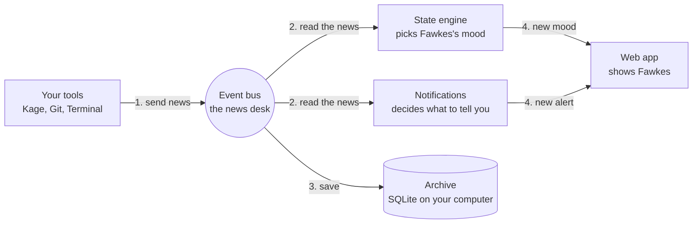
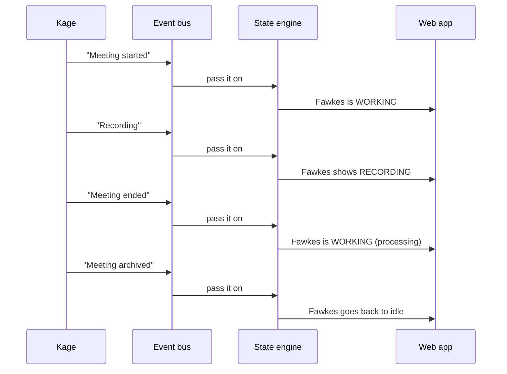

# How Phoenix works

**Phoenix is one small program running on your computer.** Your tools tell it what is happening. It decides how Fawkes (the pet) should look, and shows you.

## The idea in 30 seconds

Think of a **newsroom**:

- **Capabilities** (Kage, Git, Terminal) are reporters. They send in news: "a meeting started", "a commit was made".
- The **event bus** is the news desk. All news goes through it.
- The **state engine** is the editor. It reads the news and decides Fawkes's mood: idle, working, recording, error.
- The **web app** is the screen on your wall. It shows Fawkes and updates live.
- **SQLite** is the archive. Everything is saved on your computer.

## The big picture

Everything flows one way: **tools → bus → reactions → screen**.

## Example: recording a meeting

At the same time, a meeting tracker asks Kage for the transcript and summary and saves them.

## Who does what

| Part              | In plain words                                                                   |
| ----------------- | -------------------------------------------------------------------------------- |
| **API**           | The front door. Only lets in requests that have your session token.              |
| **Event bus**     | Receives every event, checks it, drops duplicates, passes it to whoever cares.   |
| **State engine**  | Turns events into a Fawkes mood.                                                 |
| **Notifications** | Picks which events deserve an alert.                                             |
| **Capabilities**  | Plug-ins that connect outside tools (Kage, Git, Terminal).                       |
| **Permissions**   | The security guard. Approves actions, keeps an audit log, has an emergency stop. |
| **Storage**       | SQLite file for data, OS keychain for API keys.                                  |
| **Fawkes**        | The pet drawing, shown in the web app.                                           |

## Where things live in the code

| Folder          | What is inside                                                                  |
| --------------- | ------------------------------------------------------------------------------- |
| `protocol/`     | The shared language: event shapes, error codes, pet states                      |
| `core/`         | The server and its parts (API, bus, state engine, permissions, policy, storage) |
| `ai/`           | Memory, the context engine, model providers and the tool gateway                |
| `capabilities/` | Kage, Git, Terminal, Docker, Frappe, Agents, Issues and a mock                  |
| `sdk/`          | Toolkit for building a new capability                                           |
| `pet/`          | Fawkes: states, animations, art                                                 |
| `apps/web/`     | The screen you look at                                                          |
| `apps/desktop/` | Floating Fawkes on your desktop (not built yet)                                 |

`core/runtime` is the piece that starts everything and connects the parts together.

**Memory and AI.** Core remembers git commits, the markdown files you list and (only if you allow it) meeting summaries, in the same SQLite file as everything else, with a lexical index. You can browse, search, forget and delete it, and set how long each kind is kept. AI is off until you turn it on; it then uses Ollama on this device. Nothing goes to a cloud provider unless you grant external processing and opt in for that kind of data, and sensitive data has its own separate opt-in (`docs/security-review.md`). The runtime builds one tool gateway (`runtime.toolGateway`); no route exposes it or the policy rules. **Agents (Phase 31).** `runtime.agents` runs tasks through the orchestrator (`ai/orchestrator`): classify, retrieve context, plan, policy check, execute, verify, respond, audit, with the trace kept in SQLite. An agent holds only the tool gateway, so every action has a policy decision and an audit record, and anything above low risk waits in the same `/api/confirmations` flow as everything else. Automation is off until you turn it on (`POST /api/agent/settings`). The first agent (`ai/agents`) explains a failed CI run from GitHub job data, recent commits and memory; it only advises, because no write capability for CI exists.

**Meeting review, retrieval and the graph (Phases 35, 37, 38).** `runtime.meetingReview` imports Kage's decisions and action items as `proposed` after each meeting sync; a person accepts, edits or rejects them over `/api/meeting-items/*`, and only accepted ones become memory facts (extraction by a model happens only when the user presses the button, and stays on this device). `runtime.retrieval` embeds memories in the background (from `memory.maintain()`, bounded and single-flight) and `/api/memory/search`, `/api/memory/ask` and the meeting search use keyword + vector search fused together when both AI and `retrieval.enabled` are on; both are off by default and then Core behaves exactly as before (`retrieval.mode` in every response says which ran). `runtime.graph` keeps a property graph of people, commits, issues, meetings and decisions in the same SQLite file, each link with its source; a new commit event is enriched by reading the watched repository, and everything derived is deleted with its source (triggers for memory, meetings and events; explicit calls for the sensitive-meetings opt-out and for forgetting a person). `GET /api/privacy` lists vectors, the graph and review items under `derived`.
