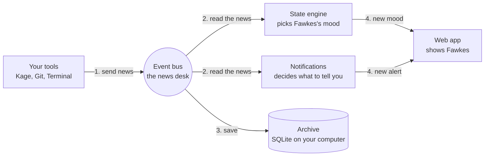
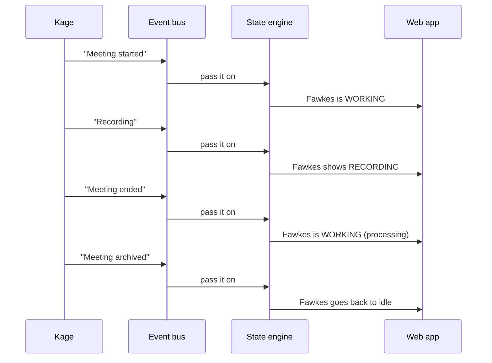

# How Phoenix works

**Phoenix is one small program running on your computer.** Your tools tell it what is happening. It decides how Fawkes (the pet) should look, and shows you.

## The idea in 30 seconds

Think of a **newsroom**:

- **Capabilities** (Kage, Git, Terminal) are reporters. They send in news: "a meeting started", "a commit was made".
- The **event bus** is the news desk. All news goes through it.
- The **state engine** is the editor. It reads the news and decides Fawkes's mood: idle, working, recording, error.
- The **web app** is the screen on your wall. It shows Fawkes and updates live.
- **SQLite** is the archive. Everything is saved on your computer.

## The big picture

Everything flows one way: **tools → bus → reactions → screen**.

## Example: recording a meeting

At the same time, a meeting tracker asks Kage for the transcript and summary and saves them.

## Who does what

| Part              | In plain words                                                                   |
| ----------------- | -------------------------------------------------------------------------------- |
| **API**           | The front door. Only lets in requests that have your session token.              |
| **Event bus**     | Receives every event, checks it, drops duplicates, passes it to whoever cares.   |
| **State engine**  | Turns events into a Fawkes mood.                                                 |
| **Notifications** | Picks which events deserve an alert.                                             |
| **Capabilities**  | Plug-ins that connect outside tools (Kage, Git, Terminal).                       |
| **Permissions**   | The security guard. Approves actions, keeps an audit log, has an emergency stop. |
| **Storage**       | SQLite file for data, OS keychain for API keys.                                  |
| **Fawkes**        | The pet drawing, shown in the web app.                                           |

## Where things live in the code

| Folder          | What is inside                                                          |
| --------------- | ----------------------------------------------------------------------- |
| `protocol/`     | The shared language: event shapes, error codes, pet states              |
| `core/`         | The server and its parts (API, bus, state engine, permissions, storage) |
| `capabilities/` | Kage, Git, Terminal and a mock for testing                              |
| `sdk/`          | Toolkit for building a new capability                                   |
| `pet/`          | Fawkes: states, animations, art                                         |
| `apps/web/`     | The screen you look at                                                  |
| `apps/desktop/` | Floating Fawkes on your desktop (not built yet)                         |

`core/runtime` is the piece that starts everything and connects the parts together.
