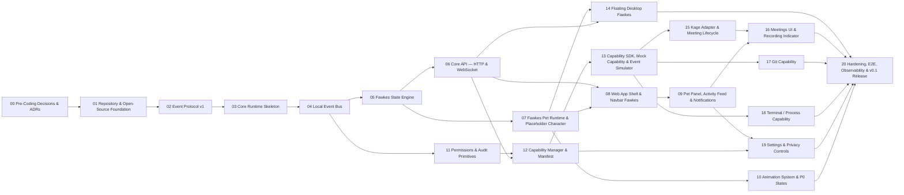

# Phoenix Phase Tracker

Single source of truth for delivery progress. Derived from the five vision documents in [`docs/vision/`](../vision/).

**Status legend:** ⬜ Not started · 🟨 In progress · ✅ Done · ⛔ Blocked

**How to use:** when a phase starts, change its status here *and* in the phase file. A phase is ✅ only when every exit criterion in its file is checked. Do not start a new stage until the stage gate above it is met — the roadmap advances on technical gates, not calendar dates.

## Current focus

Next up: **Phase 08 — Web shell & navbar Fawkes** and **Phase 12 — Capability manager** (both unblocked), then 09, 13 and 14.

## Summary

| Stage | Release | Phases | Done |
|---|---|---|---|
| Stage 1 — MVP Foundation | v0.1 | 00–20 (21) | 8/21 |
| Stage 2 — Useful Fawkes (v0.2) | v0.2 | 21–26 (6) | 0/6 |
| Stage 3 — Memory & Context (v0.3) | v0.3 | 27–29 (3) | 0/3 |
| Stage 4 — Fawkes Becomes an Agent (v0.4) | v0.4 | 30–33 (4) | 0/4 |
| Stage 5 — Developer-Agent Orchestration (v0.5) | v0.5 | 34 (1) | 0/1 |
| Stage 6 — Meeting → Engineering (v0.6) | v0.6 | 35–36 (2) | 0/2 |
| Stage 7 — Knowledge Graph (v0.7) | v0.7 | 37–38 (2) | 0/2 |
| Stage 8 — Automation & Workflows (v0.8) | v0.8 | 39–40 (2) | 0/2 |
| Stage 9 — Capability Ecosystem (v0.9) | v0.9 | 41–42 (2) | 0/2 |
| Stage 10 — Developer Operating Layer (v1.0) | v1.0 | 43–44 (2) | 0/2 |
| Stage 11 — AI Evolution (v1.1 → v2.0) | v1.1 → v2.0 | 45–55 (11) | 0/11 |
| **Total** | | **56** | **8/56** |

## Stage 1 — MVP Foundation

| # | Phase | Release | Priority | Depends on | Status | Owner | Notes |
|---|---|---|---|---|---|---|---|
| 00 | [Pre-Coding Decisions & ADRs](phase-00-decisions-and-adrs.md) | v0.1 | Critical | — | 🟨 | | Desktop spike + Kage contract confirmation open |
| 01 | [Repository & Open-Source Foundation](phase-01-repo-and-open-source-foundation.md) | v0.1 | Critical | 00 | ✅ | | |
| 02 | [Event Protocol v1](phase-02-event-protocol-v1.md) | v0.1 | Critical | 01 | ✅ | | |
| 03 | [Core Runtime Skeleton](phase-03-core-runtime-skeleton.md) | v0.1 | Critical | 02 | ✅ | | |
| 04 | [Local Event Bus](phase-04-event-bus.md) | v0.1 | Critical | 03 | ✅ | | |
| 05 | [Fawkes State Engine](phase-05-state-engine.md) | v0.1 | Critical | 04 | ✅ | | |
| 06 | [Core API — HTTP & WebSocket](phase-06-core-api-http-websocket.md) | v0.1 | Critical | 05 | ✅ | | |
| 07 | [Fawkes Pet Runtime & Placeholder Character](phase-07-fawkes-pet-runtime.md) | v0.1 | Critical | 05 | ✅ | | |
| 08 | [Web App Shell & Navbar Fawkes](phase-08-web-shell-navbar-fawkes.md) | v0.1 | Critical | 06, 07 | ⬜ | | |
| 09 | [Pet Panel, Activity Feed & Notifications](phase-09-pet-panel-activity-notifications.md) | v0.1 | Critical | 08 | ⬜ | | |
| 10 | [Animation System & P0 States](phase-10-animation-system-p0-states.md) | v0.1 | High | 07 | ⬜ | | |
| 11 | [Permissions & Audit Primitives](phase-11-permissions-and-audit.md) | v0.1 | Critical | 04 | ✅ | | |
| 12 | [Capability Manager & Manifest](phase-12-capability-manager.md) | v0.1 | Critical | 11, 06 | ⬜ | | |
| 13 | [Capability SDK, Mock Capability & Event Simulator](phase-13-capability-sdk-mock-simulator.md) | v0.1 | Critical | 12 | ⬜ | | |
| 14 | [Floating Desktop Fawkes](phase-14-floating-desktop-fawkes.md) | v0.1 | High | 07, 06 | ⬜ | | |
| 15 | [Kage Adapter & Meeting Lifecycle](phase-15-kage-adapter-meeting-lifecycle.md) | v0.1 | Critical | 13 | ⬜ | | |
| 16 | [Meetings UI & Recording Indicator](phase-16-meetings-ui.md) | v0.1 | Critical | 15, 09 | ⬜ | | |
| 17 | [Git Capability](phase-17-git-capability.md) | v0.1 | High | 13 | ⬜ | | |
| 18 | [Terminal / Process Capability](phase-18-terminal-process-capability.md) | v0.1 | High | 13 | ⬜ | | |
| 19 | [Settings & Privacy Controls](phase-19-settings-and-privacy.md) | v0.1 | High | 09, 12 | ⬜ | | |
| 20 | [Hardening, E2E, Observability & v0.1 Release](phase-20-hardening-and-v0-1-release.md) | v0.1 | Critical | 14, 16, 17, 18, 19, 10 | ⬜ | | |

**Stage gate:** PRD v2.0 §30 Definition of Done met; core event/state/pet loop stable.

## Stage 2 — Useful Fawkes (v0.2)

| # | Phase | Release | Priority | Depends on | Status | Owner | Notes |
|---|---|---|---|---|---|---|---|
| 21 | [Post-MVP Stabilisation](phase-21-post-mvp-stabilization.md) | v0.2 | Critical | 20 | ⬜ | | |
| 22 | [GitHub & CI/CD Capability](phase-22-github-and-cicd-capability.md) | v0.2 | High | 21 | ⬜ | | |
| 23 | [Frappe / ERPNext Capability](phase-23-frappe-erpnext-capability.md) | v0.2 | High | 21 | ⬜ | | |
| 24 | [Docker & Editor Capabilities](phase-24-docker-and-editor-capabilities.md) | v0.2 | Medium | 21 | ⬜ | | |
| 25 | [Coding-Agent Lifecycle Events](phase-25-coding-agent-lifecycle-events.md) | v0.2 | High | 21 | ⬜ | | |
| 26 | [Issue Tracker Capabilities & v0.2 Release](phase-26-issue-tracker-capabilities.md) | v0.2 | Medium | 22, 23, 24, 25 | ⬜ | | |

**Stage gate:** Multiple integrations operate through the capability model.

## Stage 3 — Memory & Context (v0.3)

| # | Phase | Release | Priority | Depends on | Status | Owner | Notes |
|---|---|---|---|---|---|---|---|
| 27 | [Model Adapter & Router](phase-27-model-adapter-and-router.md) | v0.3 | High | 26 | ⬜ | | |
| 28 | [Context Engine & Basic Memory Store](phase-28-context-engine-and-memory-store.md) | v0.3 | High | 27 | ⬜ | | |
| 29 | [Memory Governance & Inspection UX](phase-29-memory-governance-ux.md) | v0.3 | High | 28 | ⬜ | | |

**Stage gate:** Memory is permission-aware and inspectable.

## Stage 4 — Fawkes Becomes an Agent (v0.4)

| # | Phase | Release | Priority | Depends on | Status | Owner | Notes |
|---|---|---|---|---|---|---|---|
| 30 | [Policy Gateway & Tool Gateway](phase-30-policy-and-tool-gateway.md) | v0.4 | Critical | 29 | ⬜ | | |
| 31 | [Agent Runtime & First Vertical Slice](phase-31-agent-runtime-first-vertical-slice.md) | v0.4 | Critical | 30 | ⬜ | | |
| 32 | [Fawkes Chat & Approval UX](phase-32-fawkes-chat-and-approval-ux.md) | v0.4 | High | 31 | ⬜ | | |
| 33 | [AI Evaluation Harness & v0.4 Release](phase-33-ai-evaluation-harness.md) | v0.4 | High | 31 | ⬜ | | |

**Stage gate:** Agent actions are controlled and auditable.

## Stage 5 — Developer-Agent Orchestration (v0.5)

| # | Phase | Release | Priority | Depends on | Status | Owner | Notes |
|---|---|---|---|---|---|---|---|
| 34 | [Coding-Agent Orchestration](phase-34-coding-agent-orchestration.md) | v0.5 | High | 33, 25 | ⬜ | | |

**Stage gate:** Agent lifecycle and external events can be correlated.

## Stage 6 — Meeting → Engineering (v0.6)

| # | Phase | Release | Priority | Depends on | Status | Owner | Notes |
|---|---|---|---|---|---|---|---|
| 35 | [Kage Decisions & Action-Item Extraction](phase-35-kage-decisions-and-action-items.md) | v0.6 | High | 33, 16 | ⬜ | | |
| 36 | [Action Items → Engineering Tasks](phase-36-action-items-to-engineering-tasks.md) | v0.6 | High | 35, 22, 23 | ⬜ | | |

**Stage gate:** Meeting artifacts can become structured engineering context.

## Stage 7 — Knowledge Graph (v0.7)

| # | Phase | Release | Priority | Depends on | Status | Owner | Notes |
|---|---|---|---|---|---|---|---|
| 37 | [Hybrid Retrieval (Lexical + Vector + Rerank)](phase-37-hybrid-retrieval.md) | v0.7 | High | 36 | ⬜ | | |
| 38 | [Knowledge Graph & Provenance](phase-38-knowledge-graph-and-provenance.md) | v0.7 | High | 37 | ⬜ | | |

**Stage gate:** Graph/hybrid retrieval proves measurable value.

## Stage 8 — Automation & Workflows (v0.8)

| # | Phase | Release | Priority | Depends on | Status | Owner | Notes |
|---|---|---|---|---|---|---|---|
| 39 | [Workflow Engine](phase-39-workflow-engine.md) | v0.8 | High | 38 | ⬜ | | |
| 40 | [Workflow Safety & v0.8 Release](phase-40-workflow-safety.md) | v0.8 | High | 39 | ⬜ | | |

**Stage gate:** Workflow execution is reliable and safe.

## Stage 9 — Capability Ecosystem (v0.9)

| # | Phase | Release | Priority | Depends on | Status | Owner | Notes |
|---|---|---|---|---|---|---|---|
| 41 | [SDK Stabilisation & Developer Docs](phase-41-sdk-stabilization-and-docs.md) | v0.9 | High | 40 | ⬜ | | |
| 42 | [Capability Registry & v0.9 Release](phase-42-capability-registry.md) | v0.9 | High | 41 | ⬜ | | |

**Stage gate:** SDK/ecosystem and core are stable enough for external users.

## Stage 10 — Developer Operating Layer (v1.0)

| # | Phase | Release | Priority | Depends on | Status | Owner | Notes |
|---|---|---|---|---|---|---|---|
| 43 | [Developer Preview Programme](phase-43-developer-preview-program.md) | v1.0 | High | 42 | ⬜ | | |
| 44 | [v1.0 — Developer Operating Layer Release](phase-44-v1-0-operating-layer-release.md) | v1.0 | Critical | 43 | ⬜ | | |

**Stage gate:** v1.0 capability set stable; AI reliably at L2–L3.

## Stage 11 — AI Evolution (v1.1 → v2.0)

| # | Phase | Release | Priority | Depends on | Status | Owner | Notes |
|---|---|---|---|---|---|---|---|
| 45 | [Cross-Device Context & Sync](phase-45-cross-device-context.md) | v1.1 | Medium | 44 | ⬜ | | |
| 46 | [Personal Knowledge Engine](phase-46-personal-knowledge-engine.md) | v1.2 | High | 45 | ⬜ | | |
| 47 | [Multi-Agent Runtime](phase-47-multi-agent-runtime.md) | v1.3 | High | 46 | ⬜ | | |
| 48 | [Phoenix World Model](phase-48-world-model.md) | v1.4 | Medium | 47 | ⬜ | | |
| 49 | [Controlled Autonomous Agents](phase-49-controlled-autonomy.md) | v1.5 | High | 48 | ⬜ | | |
| 50 | [AI Capability Ecosystem](phase-50-ai-capability-ecosystem.md) | v1.6 | Medium | 49 | ⬜ | | |
| 51 | [Agent-to-Agent Collaboration](phase-51-agent-to-agent-collaboration.md) | v1.7 | Medium | 50 | ⬜ | | |
| 52 | [Predictive & Proactive Intelligence](phase-52-proactive-intelligence.md) | v1.8 | Medium | 51 | ⬜ | | |
| 53 | [Self-Improving Workflows & Evaluation Loop](phase-53-evaluation-feedback-loop.md) | v1.9 | Medium | 52 | ⬜ | | |
| 54 | [Multimodal Interaction (Speech & Vision)](phase-54-multimodal-interaction.md) | v2.0 | Medium | 53 | ⬜ | | |
| 55 | [v2.0 — Ambient AI Operating Layer](phase-55-v2-0-ambient-ai-layer.md) | v2.0 | High | 54 | ⬜ | | |

**Stage gate:** v2.0 Definition of Done (AI Evolution §26) met.

## MVP dependency graph (v0.1)

Parallel tracks once Phase 05 is done: **UI** (07, 08, 09, 10), **Platform** (11, 12, 13), **Desktop** (14). Kage (15–16) needs the SDK; Git/Terminal (17–18) can run in parallel with Kage.

## Source documents

| Document | Drives |
|---|---|
| Fawkes PRD v1.0 | Product definition, MVP scope, FRs (Stage 1) |
| Full System PRD v2.0 | Engineering baseline, sprints 0–9, v0.1 DoD (Stage 1) |
| Technical Specification Suite 04–14 | Contracts for AI, events, SDK, agents, memory, security, desktop, eval, preview, backlog (Stages 1–10) |
| Post-MVP Product Roadmap v1.0 | v0.2 → v1.0 phases and gates (Stages 2–10) |
| AI Evolution v1.0 → v2.0 | v1.1 → v2.0 AI phases (Stage 11) |
